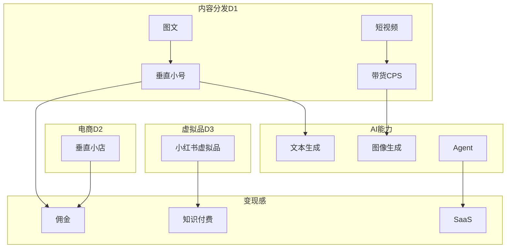

# 全网关系总览（研究用 · 可复杂）

> **给谁读：** 制作人 / Agent。非读者首页。权威节点仍在 `data/map.json`。

```mermaid
flowchart TB
  subgraph content [内容分发D1]
    short[短视频] --> cps[带货CPS]
    text[图文] --> niche[垂直小号]
  end
  subgraph commerce [电商D2]
    shop[垂直小店]
  end
  subgraph virtual [虚拟品D3]
    xhs[小红书虚拟品]
  end
  subgraph ai [AI能力]
    tgen[文本生成]
    igen[图像生成]
    agent[Agent]
  end
  subgraph money [变现感]
    commission[佣金]
    course[知识付费]
    saas[SaaS]
  end
  niche --> tgen
  cps --> igen
  niche --> commission
  xhs --> course
  agent --> saas
  shop --> commission
```

更全边表：直接打开 `data/map.json` 的 `edges`。
