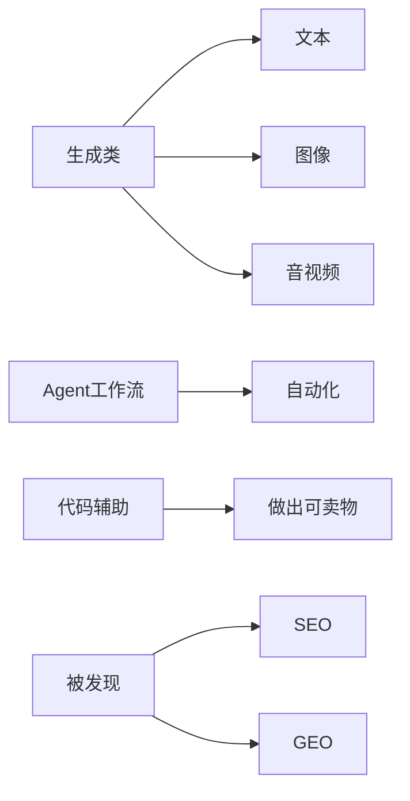

# AI 能力层

> 权威：`data/map.json` → view `V-ai`。记能力，不绑单款工具名。

```mermaid
flowchart LR
  gen[生成类] --> text[文本]
  gen --> image[图像]
  gen --> av[音视频]
  agent[Agent工作流] --> auto[自动化]
  code[代码辅助] --> ship[做出可卖物]
  discover[被发现] --> seo[SEO]
  discover --> geo[GEO]
```
