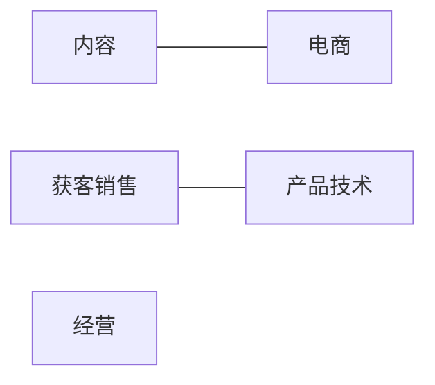

# 技能总览

> 权威：`data/map.json` → view `V-skills`。完整列表见 [卡片/技能/00-索引.md](../卡片/技能/00-索引.md)。

```mermaid
flowchart LR
  content[内容] --- commerce[电商]
  growth[获客销售] --- build[产品技术]
  ops[经营]
```

各组下技能卡以 JSON 为准（选题、文案、剪辑、选品、成交、编程…）。
