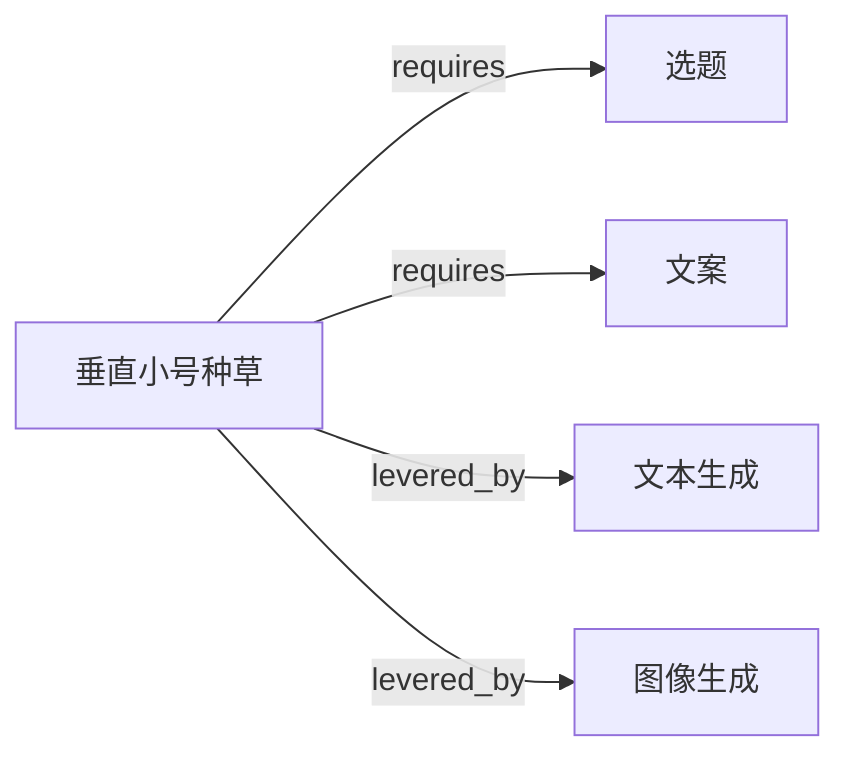

# 玩法咬合：垂直小号种草

> 权威：`data/map.json` → view `V-play-niche-bite`。

```mermaid
flowchart LR
  play[垂直小号种草]
  play -->|requires| s1[选题]
  play -->|requires| s2[文案]
  play -->|levered_by| a1[文本生成]
  play -->|levered_by| a2[图像生成]
```
