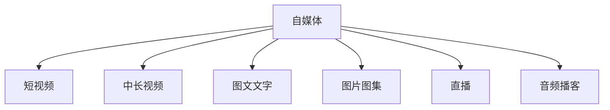

# 自媒体形态拆解

> 权威：`data/map.json` → view `V-we-media-forms`。

```mermaid
flowchart TB
  root[自媒体]
  root --> short[短视频]
  root --> long[中长视频]
  root --> text[图文文字]
  root --> img[图片图集]
  root --> live[直播]
  root --> audio[音频播客]
```
