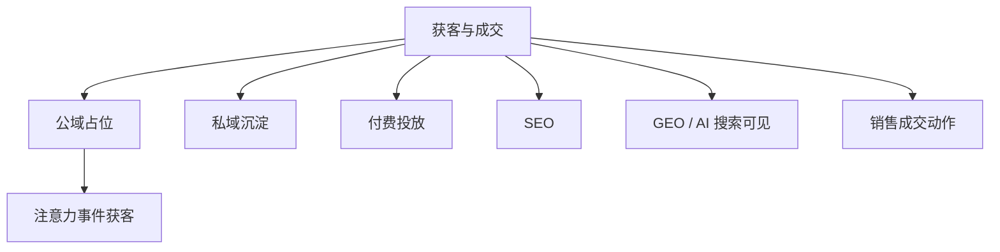

# 获客与成交

上屏图。节点只用中文，不含内部编号。

```mermaid
flowchart TB
  n1["获客与成交"]
  n2["公域占位"]
  n1 --> n2
  n3["注意力事件获客"]
  n2 --> n3
  n4["私域沉淀"]
  n1 --> n4
  n5["付费投放"]
  n1 --> n5
  n6["SEO"]
  n1 --> n6
  n7["GEO / AI 搜索可见"]
  n1 --> n7
  n8["销售成交动作"]
  n1 --> n8
```
