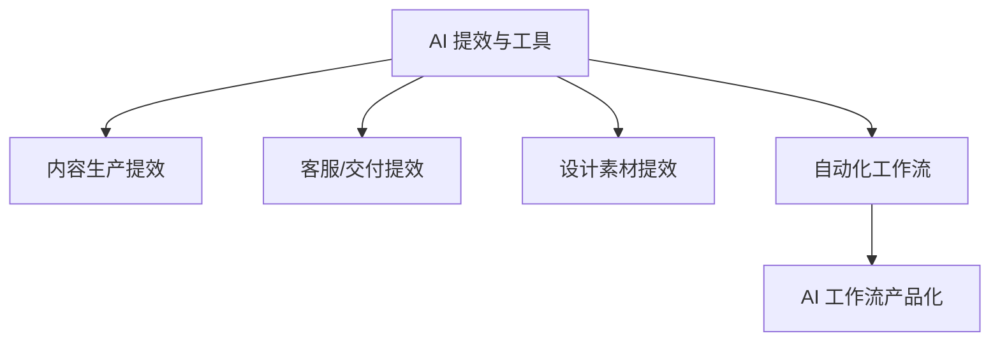

# AI 提效与工具

上屏图。节点只用中文，不含内部编号。

```mermaid
flowchart TB
  n1["AI 提效与工具"]
  n2["内容生产提效"]
  n1 --> n2
  n3["客服/交付提效"]
  n1 --> n3
  n4["设计素材提效"]
  n1 --> n4
  n5["自动化工作流"]
  n1 --> n5
  n6["AI 工作流产品化"]
  n5 --> n6
```
