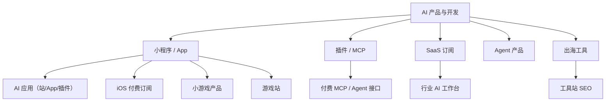

# AI 产品与开发

上屏图。节点只用中文，不含内部编号。

```mermaid
flowchart TB
  n1["AI 产品与开发"]
  n2["小程序 / App"]
  n1 --> n2
  n3["AI 应用（站/App/插件）"]
  n2 --> n3
  n4["iOS 付费订阅"]
  n2 --> n4
  n5["小游戏产品"]
  n2 --> n5
  n13["游戏站"]
  n2 --> n13
  n6["插件 / MCP"]
  n1 --> n6
  n7["付费 MCP / Agent 接口"]
  n6 --> n7
  n8["SaaS 订阅"]
  n1 --> n8
  n9["行业 AI 工作台"]
  n8 --> n9
  n10["Agent 产品"]
  n1 --> n10
  n11["出海工具"]
  n1 --> n11
  n12["工具站 SEO"]
  n11 --> n12
```
