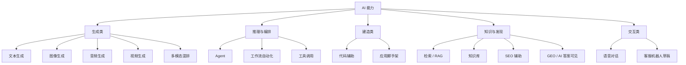

# AI 能力总图

上屏图。节点只用中文，不含内部编号。

```mermaid
flowchart TB
  n1["AI 能力"]
  n2["生成类"]
  n1 --> n2
  n3["文本生成"]
  n2 --> n3
  n4["图像生成"]
  n2 --> n4
  n5["音频生成"]
  n2 --> n5
  n6["视频生成"]
  n2 --> n6
  n7["多模态混排"]
  n2 --> n7
  n8["推理与编排"]
  n1 --> n8
  n9["Agent"]
  n8 --> n9
  n10["工作流自动化"]
  n8 --> n10
  n11["工具调用"]
  n8 --> n11
  n12["建造类"]
  n1 --> n12
  n13["代码辅助"]
  n12 --> n13
  n14["应用脚手架"]
  n12 --> n14
  n15["知识与发现"]
  n1 --> n15
  n16["检索 / RAG"]
  n15 --> n16
  n17["知识库"]
  n15 --> n17
  n18["SEO 辅助"]
  n15 --> n18
  n19["GEO / AI 答案可见"]
  n15 --> n19
  n20["交互类"]
  n1 --> n20
  n21["语音对话"]
  n20 --> n21
  n22["客服机器人草稿"]
  n20 --> n22
```
