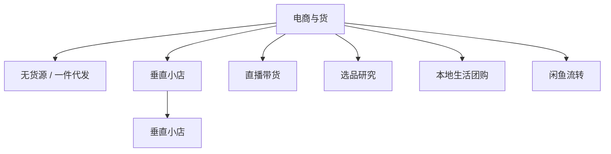

# 电商与货

上屏图。节点只用中文，不含内部编号。

```mermaid
flowchart TB
  n1["电商与货"]
  n2["无货源 / 一件代发"]
  n1 --> n2
  n3["垂直小店"]
  n1 --> n3
  n4["垂直小店"]
  n3 --> n4
  n5["直播带货"]
  n1 --> n5
  n6["选品研究"]
  n1 --> n6
  n7["本地生活团购"]
  n1 --> n7
  n8["闲鱼流转"]
  n1 --> n8
```
