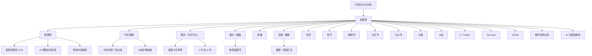

# 内容与平台分发

上屏图。节点只用中文，不含内部编号。

```mermaid
flowchart TB
  n1["内容与平台分发"]
  n2["自媒体"]
  n1 --> n2
  n3["短视频"]
  n2 --> n3
  n4["短视频带货 CPS"]
  n3 --> n4
  n5["AI 视频全球分发"]
  n3 --> n5
  n6["外卖内容推客"]
  n3 --> n6
  n7["中长视频"]
  n2 --> n7
  n8["中长内容广告分成"]
  n7 --> n8
  n9["B站好物挂链"]
  n7 --> n9
  n10["图文（文字为主）"]
  n2 --> n10
  n11["垂直小号种草"]
  n10 --> n11
  n12["X 中文 AI 号"]
  n10 --> n12
  n13["图片 / 图集"]
  n2 --> n13
  n14["微信贴图号"]
  n13 --> n14
  n15["直播"]
  n2 --> n15
  n16["音频 / 播客"]
  n2 --> n16
  n17["播客 / 音频栏目"]
  n16 --> n17
  n18["抖音"]
  n2 --> n18
  n19["快手"]
  n2 --> n19
  n20["视频号"]
  n2 --> n20
  n21["小红书"]
  n2 --> n21
  n22["公众号"]
  n2 --> n22
  n23["头条"]
  n2 --> n23
  n24["B站"]
  n2 --> n24
  n25["X / Twitter"]
  n2 --> n25
  n26["YouTube"]
  n2 --> n26
  n27["TikTok"]
  n2 --> n27
  n28["账号矩阵分发"]
  n2 --> n28
  n29["AI 主题自媒体"]
  n2 --> n29
```
