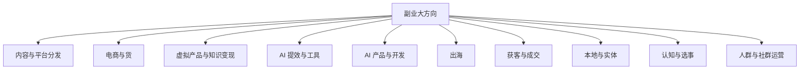

# 十大方向

上屏图。节点只用中文，不含内部编号。

```mermaid
flowchart TB
  n1["副业大方向"]
  n2["内容与平台分发"]
  n1 --> n2
  n3["电商与货"]
  n1 --> n3
  n4["虚拟产品与知识变现"]
  n1 --> n4
  n5["AI 提效与工具"]
  n1 --> n5
  n6["AI 产品与开发"]
  n1 --> n6
  n7["出海"]
  n1 --> n7
  n8["获客与成交"]
  n1 --> n8
  n9["本地与实体"]
  n1 --> n9
  n10["认知与选事"]
  n1 --> n10
  n11["人群与社群运营"]
  n1 --> n11
```
