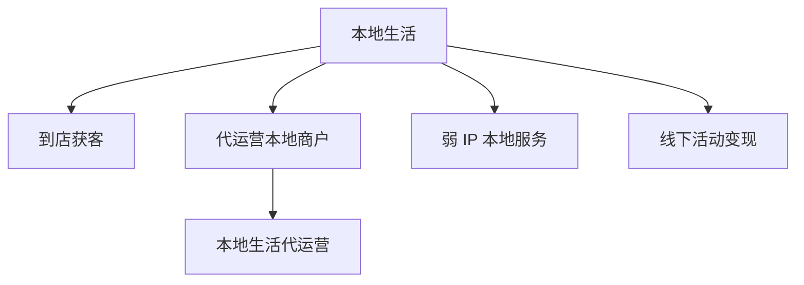

# 本地生活

上屏图。节点只用中文，不含内部编号。

```mermaid
flowchart TB
  n1["本地生活"]
  n2["到店获客"]
  n1 --> n2
  n3["代运营本地商户"]
  n1 --> n3
  n4["本地生活代运营"]
  n3 --> n4
  n5["弱 IP 本地服务"]
  n1 --> n5
  n6["线下活动变现"]
  n1 --> n6
```
