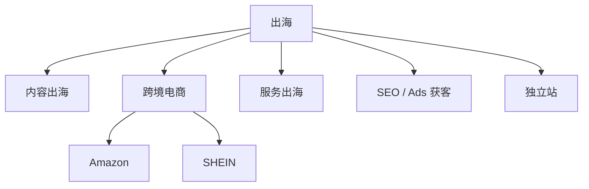

# 出海

上屏图。节点只用中文，不含内部编号。

```mermaid
flowchart TB
  n1["出海"]
  n2["内容出海"]
  n1 --> n2
  n3["跨境电商"]
  n1 --> n3
  n7["Amazon"]
  n3 --> n7
  n8["SHEIN"]
  n3 --> n8
  n4["服务出海"]
  n1 --> n4
  n5["SEO / Ads 获客"]
  n1 --> n5
  n6["独立站"]
  n1 --> n6
```
