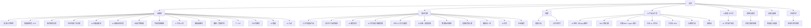

# 玩法总图

上屏图。节点只用中文，不含内部编号。

```mermaid
flowchart TB
  n1["玩法"]
  n2["自媒体"]
  n1 --> n2
  n3["垂直小号种草"]
  n2 --> n3
  n4["短视频带货 CPS"]
  n2 --> n4
  n5["账号矩阵分发"]
  n2 --> n5
  n6["中长内容广告分成"]
  n2 --> n6
  n7["AI 主题自媒体"]
  n2 --> n7
  n8["AI 视频全球分发"]
  n2 --> n8
  n9["B站好物挂链"]
  n2 --> n9
  n10["外卖内容推客"]
  n2 --> n10
  n11["X 中文 AI 号"]
  n2 --> n11
  n12["微信贴图号"]
  n2 --> n12
  n13["播客 / 音频栏目"]
  n2 --> n13
  n14["知识付费"]
  n1 --> n14
  n15["小红书虚拟产品"]
  n14 --> n15
  n16["小红书产品养成系"]
  n14 --> n16
  n17["AI 服务交付"]
  n14 --> n17
  n18["AI 工作流定制服务商"]
  n14 --> n18
  n19["企业 AI 学习与服务"]
  n14 --> n19
  n20["AI 头像 / 表情定制"]
  n14 --> n20
  n21["数据标注接单"]
  n14 --> n21
  n22["电商"]
  n1 --> n22
  n23["垂直小店"]
  n22 --> n23
  n24["AI 产品与开发"]
  n1 --> n24
  n25["AI 应用（站/App/插件）"]
  n24 --> n25
  n26["iOS 付费订阅"]
  n24 --> n26
  n27["付费 MCP / Agent 接口"]
  n24 --> n27
  n28["行业 AI 工作台"]
  n24 --> n28
  n29["工具站 SEO"]
  n24 --> n29
  n30["小游戏产品"]
  n24 --> n30
  n31["AI 提效与工具"]
  n1 --> n31
  n32["AI 工作流产品化"]
  n31 --> n32
  n33["获客与成交"]
  n1 --> n33
  n34["注意力事件获客"]
  n33 --> n34
  n35["认知与选事"]
  n1 --> n35
  n36["离流量近选事"]
  n35 --> n36
  n37["本地生活"]
  n1 --> n37
  n38["本地生活代运营"]
  n37 --> n38
  n39["个人 IP"]
  n2 --> n39
  n40["公众号爆文"]
  n2 --> n40
  n41["AI 短剧"]
  n2 --> n41
  n42["AI 小说"]
  n2 --> n42
  n43["小红书买手"]
  n22 --> n43
  n44["游戏站"]
  n24 --> n44
  n45["定制红包封面"]
  n14 --> n45
  n46["微信问一问"]
  n14 --> n46
  n47["AI 代写"]
  n14 --> n47
  n48["企业服务"]
  n14 --> n48
```
