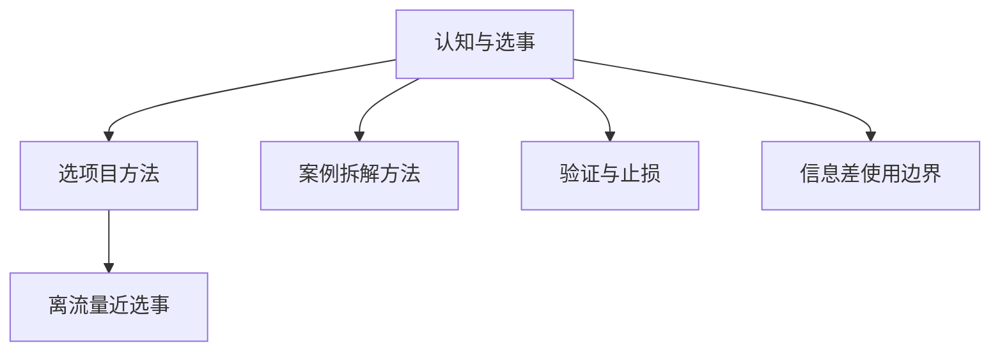

# 认知与选事

上屏图。节点只用中文，不含内部编号。

```mermaid
flowchart TB
  n1["认知与选事"]
  n2["选项目方法"]
  n1 --> n2
  n3["离流量近选事"]
  n2 --> n3
  n4["案例拆解方法"]
  n1 --> n4
  n5["验证与止损"]
  n1 --> n5
  n6["信息差使用边界"]
  n1 --> n6
```
