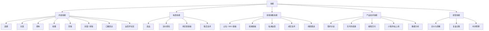

# 技能总图

上屏图。节点只用中文，不含内部编号。

```mermaid
flowchart TB
  n1["技能"]
  n2["内容技能"]
  n1 --> n2
  n3["选题"]
  n2 --> n3
  n4["文案"]
  n2 --> n4
  n5["脚本"]
  n2 --> n5
  n6["拍摄"]
  n2 --> n6
  n7["剪辑"]
  n2 --> n7
  n8["封面 / 排版"]
  n2 --> n8
  n9["口播表达"]
  n2 --> n9
  n10["运营评论区"]
  n2 --> n10
  n11["电商技能"]
  n1 --> n11
  n12["选品"]
  n11 --> n12
  n13["定价感知"]
  n11 --> n13
  n14["供应链基础"]
  n11 --> n14
  n15["售后话术"]
  n11 --> n15
  n16["获客销售技能"]
  n1 --> n16
  n17["占位 / SEO 基础"]
  n16 --> n17
  n18["投放基础"]
  n16 --> n18
  n19["私域运营"]
  n16 --> n19
  n20["成交话术"]
  n16 --> n20
  n21["线索跟进"]
  n16 --> n21
  n22["产品技术技能"]
  n1 --> n22
  n23["需求访谈"]
  n22 --> n23
  n24["无代码搭建"]
  n22 --> n24
  n25["编程交付"]
  n22 --> n25
  n26["小程序/站上线"]
  n22 --> n26
  n27["数据分析"]
  n22 --> n27
  n28["经营技能"]
  n1 --> n28
  n29["定价与套餐"]
  n28 --> n29
  n30["复盘记账"]
  n28 --> n30
  n31["时间预算"]
  n28 --> n31
```
