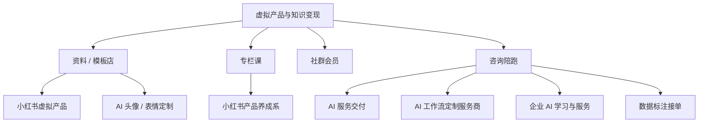

# 虚拟产品与知识变现

上屏图。节点只用中文，不含内部编号。

```mermaid
flowchart TB
  n1["虚拟产品与知识变现"]
  n2["资料 / 模板店"]
  n1 --> n2
  n3["小红书虚拟产品"]
  n2 --> n3
  n4["AI 头像 / 表情定制"]
  n2 --> n4
  n5["专栏课"]
  n1 --> n5
  n6["小红书产品养成系"]
  n5 --> n6
  n7["社群会员"]
  n1 --> n7
  n8["咨询陪跑"]
  n1 --> n8
  n9["AI 服务交付"]
  n8 --> n9
  n10["AI 工作流定制服务商"]
  n8 --> n10
  n11["企业 AI 学习与服务"]
  n8 --> n11
  n12["数据标注接单"]
  n8 --> n12
```
